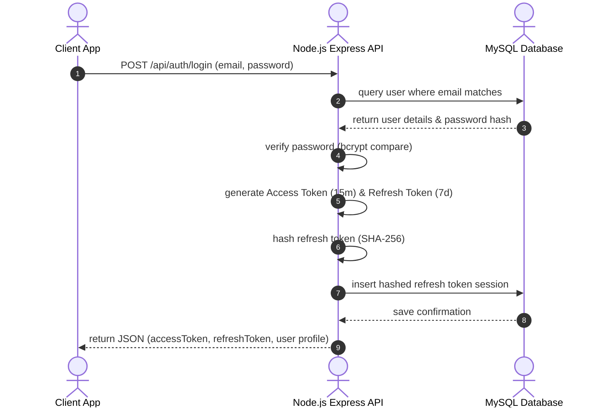
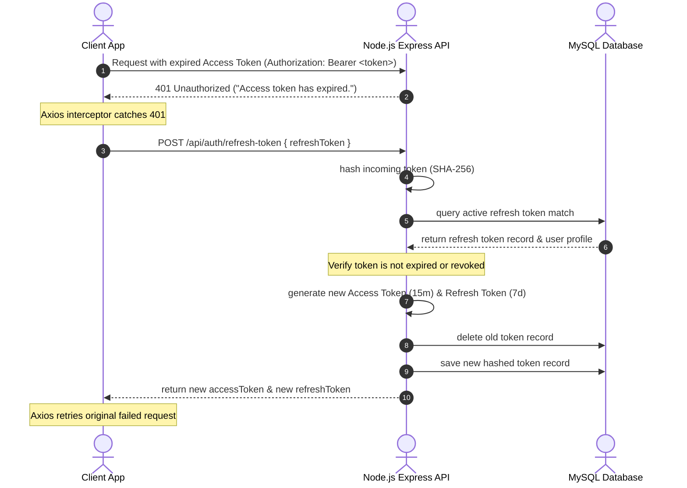
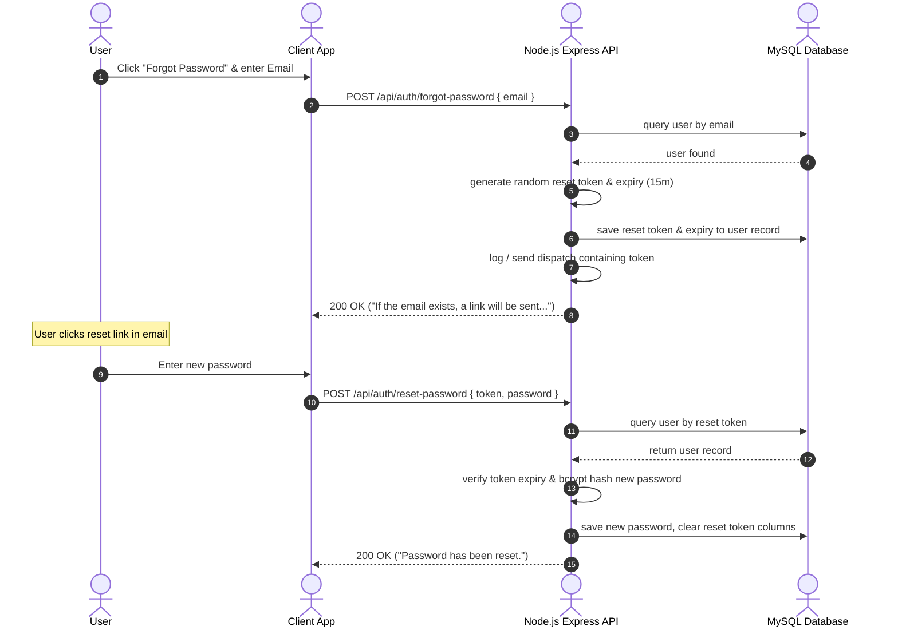

# Authentication, Authorization, & User Management System

This document outlines the architecture, flow diagrams, API specs, and RBAC policies implemented for the **Food Waste Redistribution Platform**.

---

## 1. Flow Diagrams

### JWT Authentication Flow


---

### Sliding Refresh Token Rotation Flow


---

### Password Reset Flow


---

## 2. API Documentation

### Public Endpoints

| Method | Endpoint | Description | Payload Schema | Response (Success) |
| :--- | :--- | :--- | :--- | :--- |
| **POST** | `/api/auth/register` | Register a new user profile | `{ full_name, email, phone, password, confirm_password, role, address, city, state, country, latitude, longitude }` | `201 Created` - `{ success: true, message: "...", data: user }` |
| **POST** | `/api/auth/login` | Authenticate credentials & return tokens | `{ email, password }` | `200 OK` - `{ success: true, data: { accessToken, refreshToken, user } }` |
| **POST** | `/api/auth/logout` | Revoke a single refresh token session | `{ refreshToken }` | `200 OK` - `{ success: true, message: "Successfully logged out." }` |
| **POST** | `/api/auth/refresh-token` | Rotate access and refresh tokens | `{ refreshToken }` | `200 OK` - `{ success: true, data: { accessToken, refreshToken } }` |
| **POST** | `/api/auth/forgot-password` | Request password reset token | `{ email }` | `200 OK` - `{ success: true, message: "..." }` |
| **POST** | `/api/auth/reset-password` | Change password using reset token | `{ token, password, confirm_password }` | `200 OK` - `{ success: true, message: "..." }` |
| **POST** | `/api/auth/verify-email` | Activate email status using token | `{ token }` | `200 OK` - `{ success: true, message: "..." }` |
| **POST** | `/api/auth/resend-verification` | Resend account verification token | `{ email }` | `200 OK` - `{ success: true, message: "..." }` |

### Protected Endpoints (Requires `Authorization: Bearer <accessToken>`)

| Method | Endpoint | Description | Guard Middlewares | Response (Success) |
| :--- | :--- | :--- | :--- | :--- |
| **POST** | `/api/auth/logout-all` | Revoke all active sessions of user | `auth` | `200 OK` - `{ success: true, message: "..." }` |
| **POST** | `/api/auth/change-password` | Update password from settings page | `auth` | `200 OK` - `{ success: true, message: "..." }` |
| **GET** | `/api/auth/profile` | Retrieve active profile details | `auth` | `200 OK` - `{ success: true, data: user }` |
| **PUT** | `/api/auth/profile` | Update profile fields & upload avatar | `auth` | `200 OK` - `{ success: true, data: user }` |

---

## 3. Role-Based Access Control (RBAC)

Access control rules are enforced by the `roleMiddleware(...allowedRoles)` helper.

### Configured System Roles
- `ADMIN`: Full backend access, bypasses resource ownership rules, user management operations.
- `DONOR`: Food donors (restaurant owner, supermarket manager, individual) contributing surplus food.
- `NGO`: Non-governmental organization staff accessing donation request list and coordination feeds.
- `VOLUNTEER`: Couriers driving collections and distributions.

### Example Route Enforcement
```javascript
import roleMiddleware from '../middlewares/role.middleware.js';

// Route accessible only by ADMIN and NGO roles
router.get('/coordinates', authMiddleware, roleMiddleware('ADMIN', 'NGO'), getCoordinates);
```
