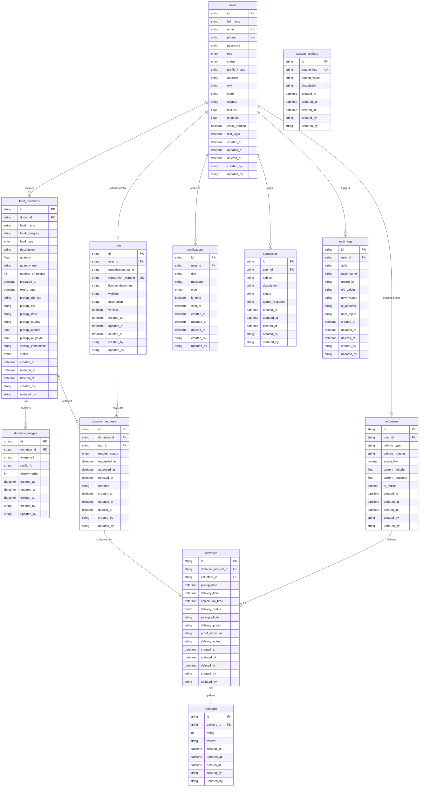

# Database Architecture - Food Waste Redistribution Platform

This document describes the database design, tables, relationships, indexes, unique constraints, and operational guides (migration and seeding) for the platform.

---

## 📊 Entity Relationship (ER) Diagram



---

## 📝 Tables & Field Descriptions

### 1. `users`
Stores accounts for all system participants.
- **`id`** (UUID, PK): Unique identifier.
- **`role`** (Enum: `ADMIN`, `DONOR`, `NGO`, `VOLUNTEER`): System role.
- **`status`** (Enum: `ACTIVE`, `INACTIVE`, `BLOCKED`): Status flag.
- **`email_verified`**: Email verification check.

### 2. `food_donations`
Surplus food donation records posted by Donors.
- **`donor_id`** (UUID, FK -> `users.id`): References the donor account.
- **`food_type`** (Enum: `VEG`, `NON_VEG`, `VEGAN`, `OTHER`): Food categorization.
- **`prepared_at` / `expiry_time`**: Safety tracking boundaries.
- **`status`** (Enum: `AVAILABLE`, `REQUESTED`, `APPROVED`, `PICKED_UP`, `DELIVERED`, `EXPIRED`, `CANCELLED`): Donation lifecycle state.

### 3. `donation_images`
Multiple image listings showing donated items.
- **`donation_id`** (UUID, FK -> `food_donations.id`): Backlink with **CASCADE DELETE**.

### 4. `ngos`
Detailed organization details for NGO profiles.
- **`user_id`** (UUID, FK -> `users.id`, Unique): Links directly to user account.
- **`registration_number`** (Unique): Governmental non-profit registry number.
- **`verified`**: Approval verification flag.

### 5. `volunteers`
Delivery courier profiles.
- **`user_id`** (UUID, FK -> `users.id`, Unique): Reference backlink.
- **`is_online` / `availability`**: Real-time matching signals.

### 6. `donation_requests`
Requested claims by NGOs for available food donations.
- **`donation_id`** (UUID, FK -> `food_donations.id`): Linked donation (**CASCADE DELETE**).
- **`ngo_id`** (UUID, FK -> `ngos.id`): Requesting NGO profile (**RESTRICT**).
- **`request_status`** (Enum: `PENDING`, `APPROVED`, `REJECTED`).

### 7. `deliveries`
Shipment courier tracking mapping.
- **`donation_request_id`** (UUID, FK -> `donation_requests.id`, Unique): Link to request (**RESTRICT**).
- **`volunteer_id`** (UUID, FK -> `volunteers.id`, Nullable): Assigned courier (**RESTRICT**).
- **`delivery_status`** (Enum: `ASSIGNED`, `PICKED_UP`, `IN_TRANSIT`, `DELIVERED`, `FAILED`).

### 8. `notifications`
User alerts and system event notifications.
- **`user_id`** (UUID, FK -> `users.id`): Backlink (**CASCADE DELETE**).

### 9. `complaints`
Tickets logged by platform users for admin review.
- **`user_id`** (UUID, FK -> `users.id`): Submitting user (**CASCADE DELETE**).

### 10. `feedback`
Post-delivery NGO reviews.
- **`delivery_id`** (UUID, FK -> `deliveries.id`, Unique): Target delivery (**CASCADE DELETE**).

### 11. `audit_logs`
Automated system trails logging write operations.
- **`user_id`** (UUID, FK -> `users.id`, Nullable): Performer ID (**SET NULL**).

### 12. `system_settings`
Centralized application settings variables (e.g. maximum delivery radius).

---

## 🛠️ Operations Guide

### Initial Database Setup & Migration
To apply the database design schema onto MySQL:
```bash
# 1. Ensure MySQL is running and database 'food' exists
# 2. Run the initial migration command
npm run prisma:migrate --prefix server
```
This executes `prisma migrate dev`, generating the SQL table schema mapping, indexes, and FK rules dynamically inside MySQL.

### Database Seeding
To fill the database tables with default parameter stubs and testing records:
```bash
# Execute seeding script
npx prisma db seed --schema=server/prisma/schema.prisma
```
This deletes pre-existing rows and populates the tables with consistent entity graphs (1 Admin, 2 NGOs, 3 Volunteers, 5 Donors, 20 Donations, 20 Requests, 10 Deliveries, Feedbacks, and Settings).
